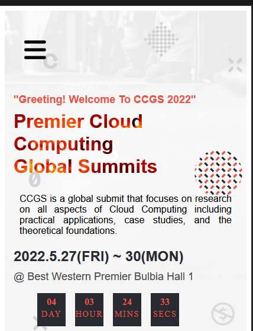
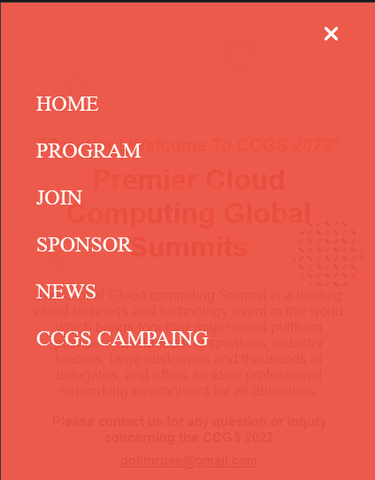
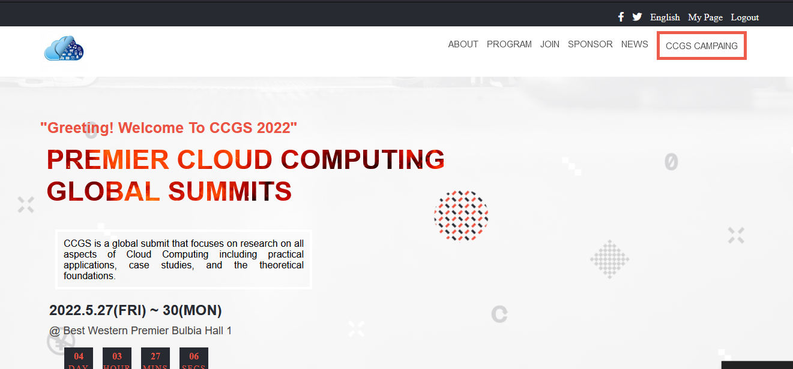

# Cloud Computing Global Summit

> CCGS is a global submit that focuses on  research on all aspects of Cloud Computing including practical applications, case studies, and the theoretical foundations.

## Built With

- HTML
- CSS
- BASIC JAVASCRIPT

## Live Demo 

[Live Demo Link](https://henrycode460.github.io/html_Capstone_Project/)

## SCREENSHOTS

## Video Description

[Link To video](https://drive.google.com/file/d/1HZ5URmrcQq5CQ-s0BS0GmW9cvww-i33O/view?usp=sharing)

## Author

👤 **Henry V. Singbeh**

- GitHub: [@githubhandle](https://github.com/henrycode460)
- Twitter: [@twitterhandle](https://twitter.com/460code)
- LinkedIn: [LinkedIn](https://www.linkedin.com/in/henry-varflay-singbeh-75707b229/)

## 🤝 Contributing

Contributions, issues, and feature requests are welcome!

Feel free to check the [issues page]([../../issues/](https://github.com/henrycode460/html_Capstone_Project/issues)).

## Show your support

Give a ⭐️ if you like this project!

## Acknowledgments

- Microverse Team.
- Micronaots.
- My partners.
- Creative Commons license of the design

## 📝 License

This project is [MIT](./MIT.md) licensed.